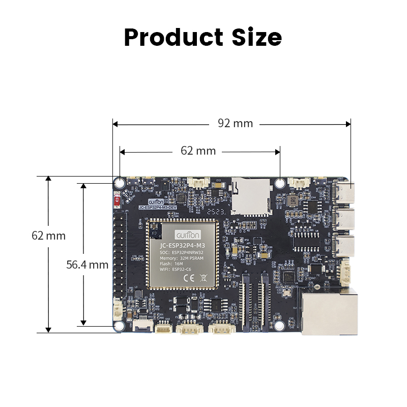

# JC-ESP32P4-M3-DEV hardware reference

Audio and network wiring for the Guition **JC-ESP32P4-M3-DEV**. The dedicated projectMM firmware is `esp32p4-jc-m3-eth`.

## Sources

- [Community hardware repository](https://github.com/p1ngb4ck/unofficial_guition_esp32p4_repo/tree/main/JC-ESP32P4-M3-Dev)
- [ES8311 product brief](https://www.everest-semi.com/pdf/ES8311%20PB.pdf)
- [Espressif `esp_codec_dev`](https://components.espressif.com/components/espressif/esp_codec_dev)

## Audio

The onboard analog microphone connects to an ES8311 mono codec. The P4 is the I2S master and drives MCLK, BCLK, and WS. The codec control bus responds at `0x18` with SDA GPIO7 and SCL GPIO8.

| Signal | GPIO | Role |
|---|---:|---|
| I2C SDA | 7 | ES8311 register control |
| I2C SCL | 8 | ES8311 register control |
| I2S WS / LRCLK | 10 | word select |
| I2S BCLK | 12 | bit clock |
| I2S MCLK | 13 | master clock, 256 × sample rate |
| I2S ADC data | 48 | codec microphone data to the P4, schematic mapping |
| I2S DAC data | 9 | P4 playback data to the codec |
| PA control | 53 | speaker amplifier enable |

The supplied ESPHome example assigns microphone data to GPIO11 and uses 16-bit samples. The published schematic routes the codec's `ES7210_SDOUT` net to GPIO48. ProjectMM defaults `sdPin` to GPIO48 because it follows the schematic, while the AudioService control stays editable live so GPIO11 can be tested without reflashing.

The codec path explicitly selects its analog microphone input and converts the scanned 7-bit address (`0x18`) to the 8-bit wire-address form expected by `esp_codec_dev`. The codec and receive channel use a 32-bit standard-I2S word. This keeps the ES8311 ADC result aligned with the `int32_t` sample path used by AudioService. The default 22,050 Hz sample rate yields a Nyquist frequency of 11,025 Hz and keeps a 512-sample analysis block near 23 ms.

## Ethernet

The board uses the P4 on-chip EMAC with an IP101-compatible RMII PHY, matching the common P4 Ethernet configuration:

| Signal | GPIO |
|---|---:|
| MDC | 31 |
| MDIO | 52 |
| PHY reset / power | 51 |
| RMII reference clock input | 50 |

The device-model entry supplies these runtime values to NetworkModule.

## Hardware validation

1. Flash `esp32p4-jc-m3-eth` and apply the `JC-ESP32P4-M3-DEV` device model.
2. Confirm Audio reports no codec initialization error.
3. Play music near the onboard microphone and inspect `level RMS`, `peakHz`, and an audio-reactive effect.
4. If the readings stay silent, change Audio `sdPin` from 48 to 11. The I2S channel rebuilds immediately.
5. To recheck the control bus, disable or remove Audio before running I2cScan because the active codec owns I2C port 0.
